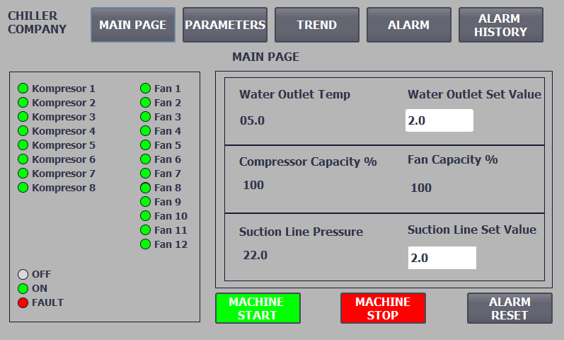
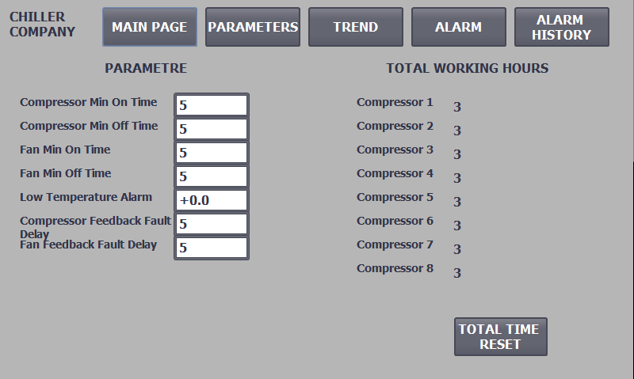
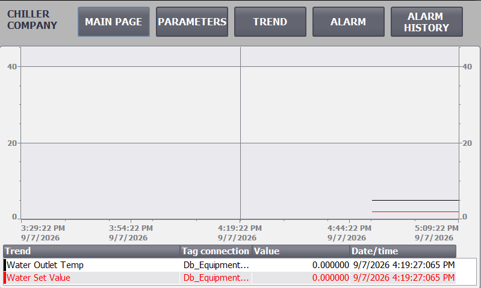
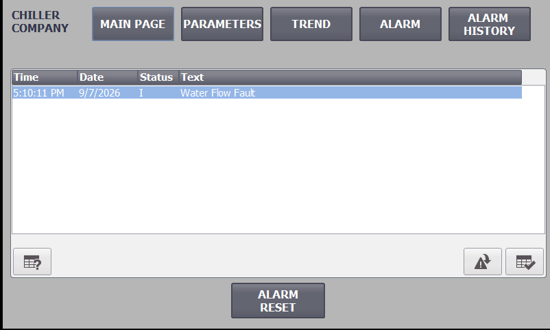
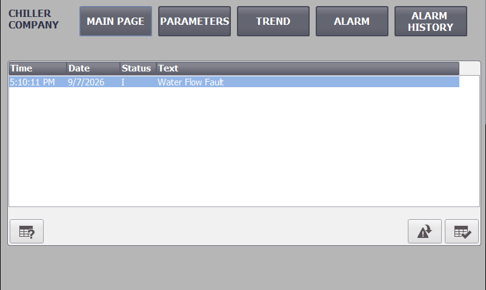
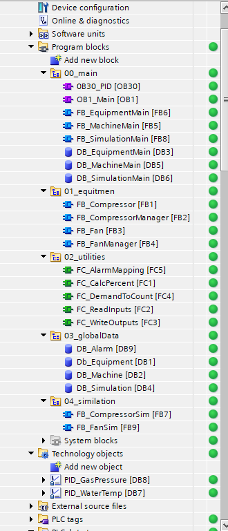

# Chiller PLC Control System — Siemens TIA Portal V19

A modular chiller control example developed in **Siemens TIA Portal V19** for learning and demonstration purposes.

The project demonstrates how a chiller application can be structured using reusable Function Blocks, global data structures, multi-instance calls, PID control, runtime-based compressor sequencing, HMI monitoring, alarm handling, historical alarm logging, trend logging, and PLCSIM-based simulation.

> **Important:** This repository is an educational example. It is not intended to be used directly on a real chiller without a complete engineering review, machine-specific safety logic, refrigeration design checks, electrical protection, commissioning, and validation.

---

## HMI Screens

### Main Page



The main page provides a quick overview of the complete chiller:

- 8 compressor status indicators
- 12 fan status indicators
- Water outlet temperature
- Water outlet temperature setpoint
- Compressor capacity %
- Fan capacity %
- Pressure value and pressure setpoint
- Machine Start
- Machine Stop
- Alarm Reset

Equipment status colors:

- **Gray** = OFF
- **Green** = ON
- **Red** = FAULT

---

### Parameters



The parameter page contains the main timing and protection parameters used by the example:

- Compressor minimum ON time
- Compressor minimum OFF time
- Fan minimum ON time
- Fan minimum OFF time
- Low temperature alarm limit
- Compressor feedback fault delay
- Fan feedback fault delay
- Compressor total operating hours
- Total runtime reset

The compressor and fan timing values are shared parameters. They are not entered separately for every individual device.

---

### Trend



The trend page records and displays process values such as:

- Water outlet temperature
- Water temperature setpoint

The HMI historical data functions are used to log these values so the operator can review how the process changes over time.

---

### Active Alarms



The Active Alarm page is configured to display only alarms that are currently active.

Examples:

- Compressor start feedback fault
- Fan start feedback fault
- Water flow fault
- Low water temperature fault

When the fault condition disappears and the fault is reset, the alarm is removed from the active alarm list.

---

### Alarm History



Alarm events are also written to an HMI alarm log.

The alarm history can therefore retain events even after the active alarm has disappeared.

Typical logged events include:

- Alarm incoming
- Alarm outgoing
- Alarm acknowledgement

This makes it possible to review when a fault occurred and when it was cleared.

---

## System Overview

The example contains:

- **8 compressors**
- **12 fans**
- Water outlet temperature control
- Pressure-based fan control
- Compressor runtime balancing
- Minimum ON/OFF times
- Start feedback supervision
- Water flow monitoring
- Low water temperature protection
- Machine Start / Stop
- HMI alarms and alarm history
- Trend logging
- PLCSIM simulation blocks

Two `PID_Compact` technology objects are used:

- `PID_WaterTemp`
- `PID_GasPressure`

The PID calculations run from a cyclic interrupt organization block.

---

## Compressor Control

The compressor control chain is:

```text
Water Outlet Temperature
        +
Water Temperature Setpoint
        |
        v
PID_WaterTemp
        |
        v
CompressorDemand (0...100 %)
        |
        v
FC_DemandToCount
        |
        v
RequiredCompressorCount (0...8)
        |
        v
FB_CompressorManager
        |
        v
FB_Compressor x 8
```

The PID output is converted from a percentage demand into a required number of compressors.

Example:

```text
CompressorDemand = 67.5 %
Total compressors = 8

RequiredCompressorCount = 6
```

The individual `FB_Compressor` blocks handle device-level logic such as:

- Enable
- Start request
- Minimum OFF time
- Minimum ON time
- Start output
- Run feedback
- Feedback timeout
- Fault state
- Runtime counting
- Status value for HMI

---

## Compressor Equal Aging

The compressor manager includes **runtime-based equal aging**.

Each compressor stores its accumulated runtime.

When additional cooling capacity is required:

> The available compressor with the **lowest runtime** is selected first.

When the requested compressor count is reduced:

> The running/requested compressor with the **highest runtime** is removed first.

This distributes operating hours across the compressor group instead of always starting Compressor 1 first.

Example:

```text
C1 = 5000 s
C2 = 4000 s
C3 = 3000 s
C4 = 2000 s
C5 = 1500 s
C6 = 1300 s
C7 = 800 s
C8 = 500 s
```

If one compressor is required, `C8` is the preferred start candidate.

The runtime values are also displayed on the HMI parameter page.

---

## Fan Control

The fan control chain is:

```text
Pressure
   +
Pressure Setpoint
   |
   v
PID_GasPressure
   |
   v
FanDemand (0...100 %)
   |
   v
FC_DemandToCount
   |
   v
RequiredFanCount (0...12)
   |
   v
FB_FanManager
   |
   v
FB_Fan x 12
```

The same generic `FC_DemandToCount` function is reused for compressors and fans.

Example:

```text
50 % demand with 12 fans
-> 6 fans required
```

The fan manager starts available fans in sequence and skips devices that are not ready or are faulted.

Fan operation is enabled only when the machine is running and compressor operation is available.

---

## Machine Start / Stop

The HMI contains momentary Machine Start and Machine Stop commands.

The basic operating concept is:

```text
START request
     |
     v
Machine Running = TRUE
     |
     +--> Compressor demand is allowed
     |
     +--> Fan demand is allowed
```

When Machine Stop is requested:

```text
Machine Running = FALSE
        |
        v
RequiredCompressorCount = 0
RequiredFanCount = 0
```

The existing equipment minimum ON/OFF logic then performs the normal controlled shutdown behavior.

---

## Feedback Supervision

Compressors and fans use run feedback monitoring.

A simplified compressor sequence is:

```text
StartRequest
     |
     v
DO_Start = TRUE
     |
     v
Feedback timer
     |
     +--> DI_OnFeedback received in time -> Running
     |
     +--> No feedback -> FeedbackFault
```

The HMI alarm system contains individual feedback alarms for all compressors and fans.

Examples:

```text
Compressor 1 - Start Feedback Fault
Compressor 2 - Start Feedback Fault
...
Fan 1 - Start Feedback Fault
...
Fan 12 - Start Feedback Fault
```

---

## Water Flow and Low Temperature Alarms

The project also includes two machine-level protection examples.

### Water Flow

`WaterFlowOK` represents the water flow switch/status.

If the machine is running and water flow is not available for the configured delay, a water flow fault is generated.

```text
Machine Running
AND
NOT WaterFlowOK
        |
        v
Water Flow Delay
        |
        v
Water Flow Fault
```

### Low Water Temperature

The current water outlet temperature is compared with the configured low temperature limit.

If the temperature remains below the limit for the configured delay, a low temperature fault is generated.

```text
WaterOutletTemp < LowTempLimit
        |
        v
Low Temperature Delay
        |
        v
Low Temperature Fault
```

Both faults are shown on the HMI alarm screen and can be stored in the alarm history.

---

## Alarm Mapping

WinCC Comfort discrete alarms are triggered through alarm words.

The PLC maps individual BOOL fault signals into `DB_Alarm` words using `FC_AlarmMapping`.

Example layout:

```text
AlarmWord1
Bit 0  -> Compressor 1 Feedback Fault
Bit 1  -> Compressor 2 Feedback Fault
...
Bit 7  -> Compressor 8 Feedback Fault
Bit 8  -> Fan 1 Feedback Fault
...
Bit 15 -> Fan 8 Feedback Fault

AlarmWord2
Bit 0 -> Fan 9 Feedback Fault
Bit 1 -> Fan 10 Feedback Fault
Bit 2 -> Fan 11 Feedback Fault
Bit 3 -> Fan 12 Feedback Fault
Bit 4 -> Water Flow Fault
Bit 5 -> Low Temperature Fault
```

This keeps the PLC alarm logic and the WinCC discrete alarm configuration organized.

---

## PLC Program Structure



The PLC program is divided into logical sections instead of placing all logic directly in `OB1`.

```text
Program blocks
|
+-- 00_main
|   +-- OB1_Main
|   +-- OB30_PID
|   +-- FB_EquipmentMain
|   +-- FB_MachineMain
|   +-- FB_SimulationMain
|   +-- DB_EquipmentMain
|   +-- DB_MachineMain
|   +-- DB_SimulationMain
|
+-- 01_equipment
|   +-- FB_Compressor
|   +-- FB_CompressorManager
|   +-- FB_Fan
|   +-- FB_FanManager
|
+-- 02_utilities
|   +-- FC_AlarmMapping
|   +-- FC_CalcPercent
|   +-- FC_DemandToCount
|   +-- FC_ReadInputs
|   +-- FC_WriteOutputs
|
+-- 03_globalData
|   +-- DB_Alarm
|   +-- DB_Equipment
|   +-- DB_Machine
|   +-- DB_Simulation
|
+-- 04_simulation
    +-- FB_CompressorSim
    +-- FB_FanSim
```

Technology objects:

```text
PID_WaterTemp
PID_GasPressure
```

The execution concept is intentionally layered:

```text
OB1
 |
 +--> Machine-level logic
 |
 +--> Equipment-level logic
 |      |
 |      +--> Managers
 |      +--> Compressor instances
 |      +--> Fan instances
 |
 +--> Simulation
 |
 +--> I/O and utility functions
```

This keeps device logic reusable and prevents the main cycle from becoming a large collection of unrelated networks.

---

## Data Structure

The equipment data is organized using reusable PLC data types.

Examples include:

```text
UDT_Compressor
UDT_Fan
UDT_Process
UDT_TimingParams
```

Typical module data is divided according to its purpose:

```text
Cfg -> Configuration
Sts -> Status
Cmd -> Commands
Par -> Parameters
Flt -> Fault information
IO  -> Input / Output data
```

This makes it easier to pass complete device structures between global DBs, managers, equipment FBs, and the HMI.

---

## Multi-Instance Design

Repeated equipment blocks are implemented as multi-instances.

Examples:

```text
FB_Compressor x 8
FB_Fan x 12
FB_CompressorSim x 8
FB_FanSim x 12
```

This reduces unnecessary instance DBs and keeps related instance data inside the corresponding main/container FB.

---

# Simulation with PLCSIM

The project contains simulation logic so the main control sequences can be tested without physical compressor and fan feedback signals.

Simulation blocks:

```text
FB_CompressorSim
FB_FanSim
FB_SimulationMain
DB_Simulation
```

The simulated equipment receives the PLC start command and generates delayed ON/OFF feedback signals.

Simplified sequence:

```text
DO_Start
   |
   v
Simulation delay
   |
   +--> OnFeedback
   +--> OffFeedback
```

---

## Recommended Watch Table

A single system watch table can be used for normal testing.

Suggested name:

```text
WT_SystemTest
```

### Simulation / Global Commands

```text
"DB_Simulation".Enabled
"DB_Machine".EnableAllEquipment
"DB_Machine".ResetAllEquipmentFaults
"DB_Machine".WaterFlowOK
```

Recommended startup:

```text
DB_Simulation.Enabled = TRUE
WaterFlowOK            = TRUE
```

`EnableAllEquipment` can be pulsed TRUE once and then returned to FALSE.

---

### Compressor Timing

Example test values:

```text
"DB_Equipment".CompressorTiming.MinOffTime   = T#5s
"DB_Equipment".CompressorTiming.MinOnTime    = T#10s
"DB_Equipment".CompressorTiming.FeedbackTime = T#5s
```

---

### Fan Timing

Example test values:

```text
"DB_Equipment".FanTiming.MinOffTime   = T#2s
"DB_Equipment".FanTiming.MinOnTime    = T#5s
"DB_Equipment".FanTiming.FeedbackTime = T#5s
```

---

### Water PID Test

Useful values to monitor:

```text
"DB_Equipment".Process.WaterTempSetPoint
"DB_Equipment".Process.WaterOutletTemp
"DB_Equipment".Process.CompressorDemand

"DB_Equipment".Process.RequiredCompressorCount
"DB_Equipment".Process.RequestedCompressorCount
"DB_Equipment".Process.RunningCompressorCount
"DB_Equipment".Process.CompressorPercent
```

Example:

```text
WaterTempSetPoint = 7.0
WaterOutletTemp   = 9.0
```

The expected sequence is:

```text
WaterOutletTemp
      |
      v
PID_WaterTemp
      |
      v
CompressorDemand
      |
      v
RequiredCompressorCount
      |
      v
RequestedCompressorCount
      |
      v
RunningCompressorCount
```

---

### Pressure / Fan PID Test

Useful values:

```text
"DB_Equipment".Process.GasPressureSetPoint
"DB_Equipment".Process.GasPressure
"DB_Equipment".Process.FanDemand

"DB_Equipment".Process.RequiredFanCount
"DB_Equipment".Process.RequestedFanCount
"DB_Equipment".Process.RunningFanCount
"DB_Equipment".Process.FanPercent
```

Enter a process pressure above the setpoint and verify that fan demand increases.

> The demo HMI labels the pressure value as **Suction Line Pressure**. In a real chiller, the exact pressure measurement used for condenser fan control must be selected according to the refrigeration design and control philosophy.

---

## HMI Parameters for Simulation

The following values can be entered directly from the HMI parameter page:

```text
Compressor Min On Time
Compressor Min Off Time
Fan Min On Time
Fan Min Off Time
Low Temperature Alarm
Compressor Feedback Fault Delay
Fan Feedback Fault Delay
```

The main page provides:

```text
Water Outlet Set Value
Pressure Set Value
Machine Start
Machine Stop
Alarm Reset
```

A typical simulation sequence is therefore:

```text
1. Start PLCSIM and download the PLC program.
2. Enable DB_Simulation.Enabled.
3. Set WaterFlowOK = TRUE.
4. Pulse EnableAllEquipment once if equipment is not already enabled.
5. Enter compressor/fan timing parameters.
6. Enter water and pressure setpoints from the HMI.
7. Start the machine from the HMI.
8. Change the simulated process values from the Watch Table.
9. Observe PID demand, requested equipment count and running equipment count.
10. Create feedback/flow/temperature fault conditions to test alarms.
11. Review active alarms and Alarm History.
```

---

## HMI / PLC Test Points

During testing, these groups are useful:

### Compressor

```text
Cmd.StartRequest
IO.DO_Start
Sts.Running
Sts.Status
Sts.RunSeconds
Flt.FeedbackFault
```

### Fan

```text
Cmd.StartRequest
IO.DO_Start
Sts.Running
Sts.Status
Flt.FeedbackFault
```

Status values:

```text
0 = OFF
1 = ON
2 = FAULT
```

---

# Scope and Limitations

This repository represents a **simplified educational chiller control example**.

A production chiller can be significantly more complex.

Depending on the machine design, a real application may include:

- Multiple independent refrigeration circuits
- Separate compressor groups for each circuit
- Different compressor capacities
- Compressor unloading / capacity control
- Variable-speed compressors
- Electronic expansion valves
- Expansion valve superheat control
- Condenser pressure control
- Evaporator pressure monitoring
- Suction and discharge pressure sensors
- Refrigerant temperature sensors
- Oil pressure / oil temperature supervision
- Motor protection
- Phase monitoring
- Pump control
- Pump feedback
- Flow switches
- Freeze protection
- High-pressure and low-pressure switches
- Sensor plausibility checks
- Additional temperature sensors
- VFD-controlled condenser fans
- Refrigerant-specific pressure/temperature calculations
- Separate alarms and permissives per refrigeration circuit
- Safety relays or safety PLC logic
- Communication diagnostics
- Remote monitoring
- Recipes and machine operating modes

For example, compressors in a real chiller may not all belong to a single common refrigeration circuit. A machine may contain two or more independent refrigerant circuits, with each compressor, pressure sensor, fan group and expansion valve assigned to a specific circuit.

In that case the control architecture should be extended from:

```text
One common compressor group
```

to something such as:

```text
Circuit 1
+-- Compressor group
+-- Pressure sensors
+-- Temperature sensors
+-- Expansion valve
+-- Fan / condenser control

Circuit 2
+-- Compressor group
+-- Pressure sensors
+-- Temperature sensors
+-- Expansion valve
+-- Fan / condenser control
```

The purpose of this repository is therefore not to define a universal chiller control algorithm, but to demonstrate **PLC software structure, reusable equipment blocks, sequencing, PID integration, simulation, HMI visualization, trending and alarm handling** in a compact project.

---

## Software / Hardware Used

- Siemens TIA Portal V19
- SIMATIC S7-1500
- CPU 1513-1 PN
- TP700 Comfort HMI
- WinCC Runtime Advanced / Comfort Panel engineering
- S7-PLCSIM
- LAD (Ladder Logic)
- PID_Compact technology objects

---

## Project Goals

This project was created as a practical learning exercise with the following goals:

- Build a complete PLC/HMI project instead of isolated tutorial examples
- Use FB, FC, DB and UDT structures
- Practice multi-instance Function Blocks
- Implement equipment managers
- Implement compressor runtime balancing
- Integrate PID control with staged equipment
- Build a PLCSIM simulation layer
- Create HMI process screens
- Configure trend logging
- Configure active alarms
- Configure historical alarm logging
- Keep the PLC program modular and easy to troubleshoot

---

## Disclaimer

This software is provided for **educational and demonstration purposes only**.

It does not replace:

- Refrigeration system engineering
- Functional safety design
- Electrical protection
- Manufacturer-specific compressor protection
- Machine risk assessment
- Commissioning procedures
- Regulatory compliance
- Site-specific interlocks

Do not deploy this example directly to production equipment without appropriate engineering, testing, validation and safety measures.

---

## License

Add the license that best fits your repository before publishing.

For an educational example, the MIT License is a common option if you want others to freely study, modify and reuse the code.
